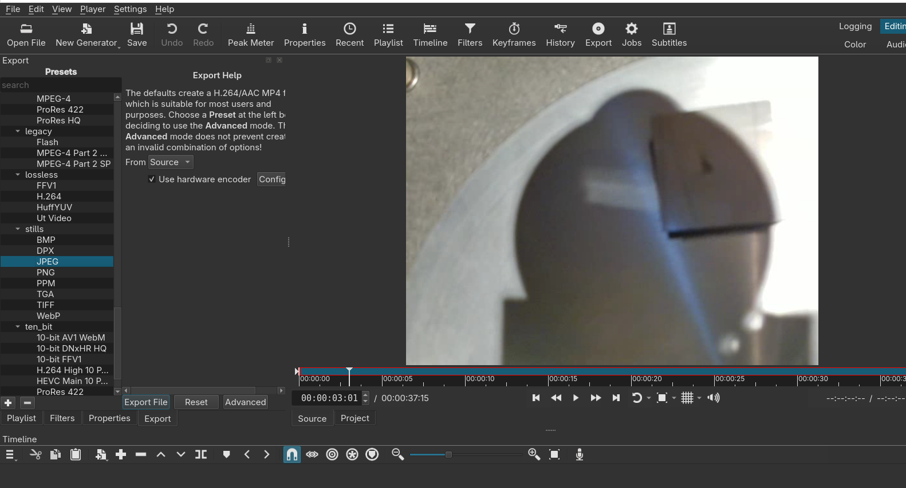
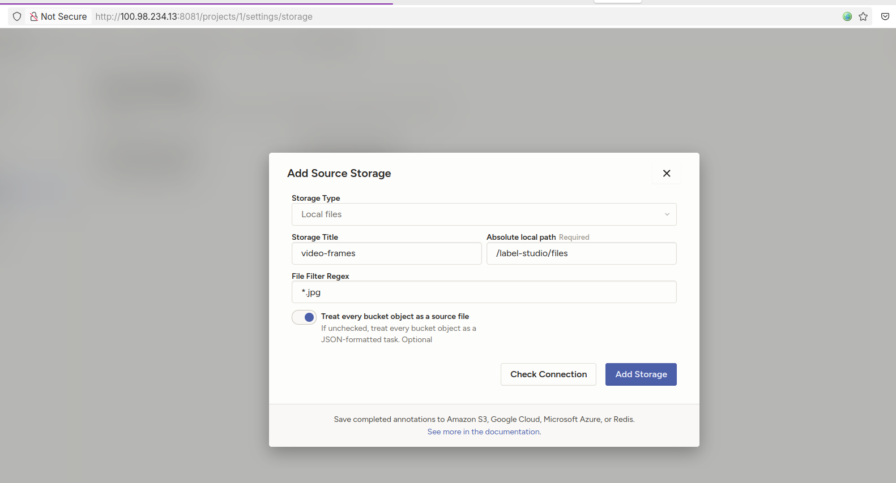
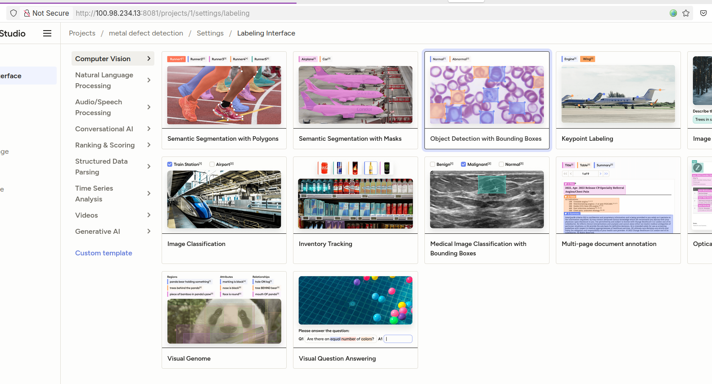
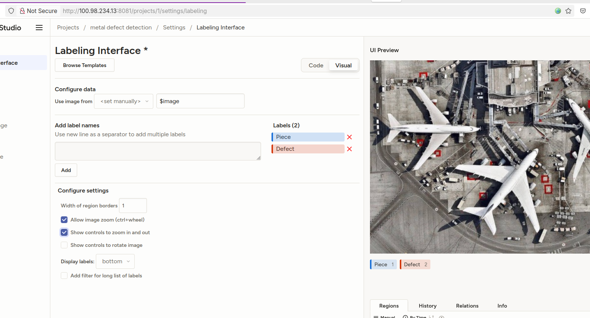
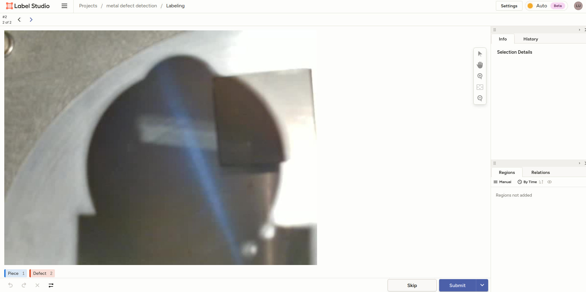
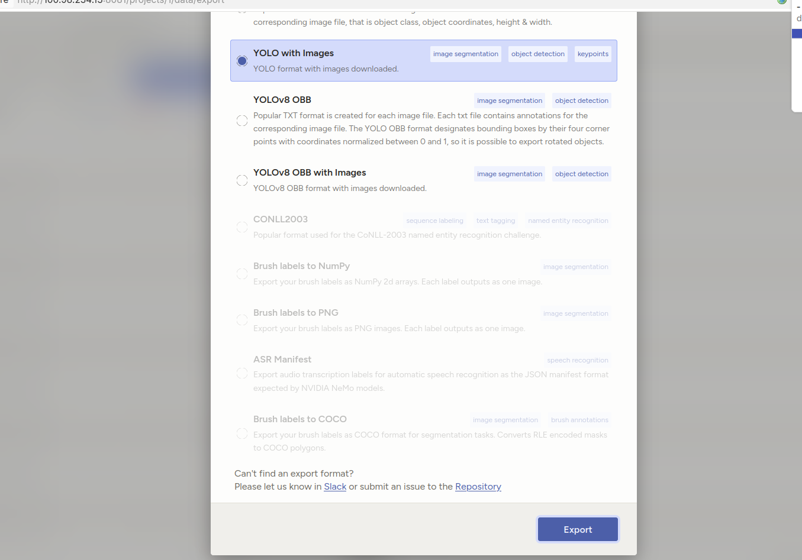
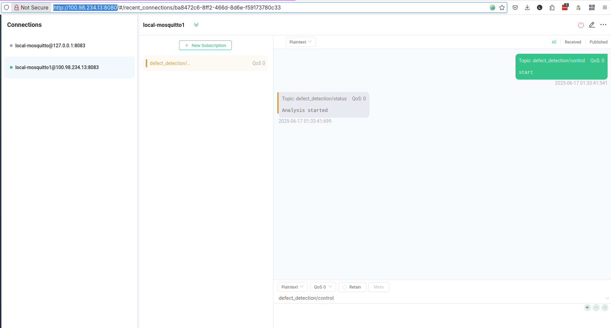

# Python defect detection application

## How to train the model
Use the recording functionality to get a video of the scenario you want to train your model on.

Using a tool like Shotcut, export the video into single frames.



You can now use a tool like [labelstudio](https://labelstud.io/) and start labelling the images according to the classification in classes you need.

To start Label Studio as a container:

```bash
podman run -d --replace --name label-studio -e LABEL_STUDIO_LOCAL_FILES_SERVING_ENABLED=true -e LABEL_STUDIO_LOCAL_FILES_DOCUMENT_ROOT=/label-studio/files -v /home/luca/apac-ai:/label-studio/files --privileged -p 8081:8080 -v /home/luca/label-studio:/label-studio/data heartexlabs/label-studio:latest
```

Setup local storage on Label Studio like shown (check instructions [here](https://labelstud.io/guide/storage#Local-storage))



We can also add a YOLO backend to help us annotate quicker [like shown](https://labelstud.io/tutorials/yolo) if needed.

Let's setup the Project as object classification.







After you complemented manual labelling you can export the labelled set into YOLO format

 

Now copy the images to the `images` folder and then separate them into train and validation (follow [this process](https://www.ejtech.io/learn/train-yolo-models))

You can run the training in a dedicated container starting first a dedicated ultralytics containaer like this:

```bash
sudo podman run -it --replace --name ultralytics --device nvidia.com/gpu=all --shm-size=4g --privileged -v /home/luca/dataset:/ultralytics/dataset ultralytics/ultralytics:latest-jetson-jetpack6 
```

*The shm-size parameter is to make sure the container is assigned enough shared memory to spin up enough torch workers*

... and then starting the training inside the container like this (this took me approx 30 minutes on the Jetson Orin):

```bash
yolo detect train data=config.yaml model=yolo11n.pt epochs=50 imgsz=640
```

Once you completed the training in the container you should see at the end of the executiong something like this:

```bash
50 epochs completed in 0.401 hours.
Optimizer stripped from /ultralytics/runs/detect/train/weights/last.pt, 5.5MB
Optimizer stripped from /ultralytics/runs/detect/train/weights/best.pt, 5.5MB

Validating /ultralytics/runs/detect/train/weights/best.pt...
Ultralytics 8.3.156 🚀 Python-3.10.12 torch-2.5.0a0+872d972e41.nv24.08 CUDA:0 (Orin, 7290MiB)
YOLO11n summary (fused): 100 layers, 2,582,542 parameters, 0 gradients, 6.3 GFLOPs
                 Class     Images  Instances      Box(P          R      mAP50  mAP50-95): 100%|██████████| 7/7 [00:04<00:00,  1.53it/s]
                   all        200        257      0.976      0.977      0.975      0.658
                Defect         30         30      0.959      0.967      0.955       0.53
                 Piece        200        227      0.993      0.987      0.995      0.786
Speed: 0.5ms preprocess, 11.2ms inference, 0.0ms loss, 3.2ms postprocess per image
Results saved to /ultralytics/runs/detect/train
💡 Learn more at https://docs.ultralytics.com/modes/train
```

You can now export the trained model from the container to use it in the Python defect detection app.

```bash
cp -r /ultralytics/runs/detect /ultralytics/dataset/
```

You can find the results of running the defect detection app with the trained `best.pt` model here

[](https://youtu.be/4DfhFfNF3l0)


## Setup and Installation
### Prerequisites

  - Python 3.8+
  - pip package manager
  - An MQTT broker (like Mosquitto) accessible on the network.
  - A YOLO model file (e.g., best.pt) trained for defect detection.

### Installation
1.  Clone/Download the project files
2.  Install Python dependencies:
    ```bash
    pip install -r requirements.txt
    ```
3.  Place your model: Put your trained `.pt` model file inside the `models/` directory.

### How to start everything automatically at system boot

See the created files in the folder [autostart](https://github.com/lucamaf/edge-defect-detector/tree/main/autostart).
You will find 2 systemd user services created based on the running **mosquitto** and **mqttx** containers and another service dedicated to launching the python application.

The priority is already set in the systemd definition so that:

1. mosquitto
2. mqttx
3. python-defect-app

Making sure the dependecies are correct between the 3 applications.

### Configuration

The application is configured using environment variables. This is especially important when running with Podman.

| Environment Variable  | Default Value                  | Description                                                                                             |
| --------------------- | ------------------------------ | ------------------------------------------------------------------------------------------------------- |
| `MQTT_BROKER`         | `localhost`                    | The IP address or hostname of your MQTT broker.                                                         |
| `MQTT_PORT`           | `1883`                         | The port for your MQTT broker.                                                                          |
| `MQTT_TOPIC_CONTROL`  | `defect_detection/control`     | The MQTT topic to send commands to the application.                                                     |
| `MQTT_TOPIC_STATUS`   | `defect_detection/status`      | The MQTT topic where the application publishes its status.                                              |
| `MODEL_PATH`          | `models/best.pt`               | The path inside the container to the YOLO model file.                                                 |
| `FLASK_WEB_PORT`      | `5000`                         | The port on which the Flask web server will listen inside the container.                                  |
| `RECORDING_PATH`      | `recordings`                   | The directory inside the container where recorded videos will be saved.                                 |
| `VIDEO_FORMAT`        | `XVID`                         | The FourCC code for the video codec. `XVID` for `.avi` or `mp4v` for `.mp4`.                              |

### How to Run the Application natively

*Make sure you have started the MQTT broker first*

1.  Set the environment variables in your terminal (optional, defaults will be used), for example:
    ```bash
    export MQTT_BROKER="192.168.1.100"
    ```
2.  Run the application:
    ```bash
    python app.py
    ```
3.  Access the UI by navigating to [localhost:5000](http://localhost:5000).


### How to Build and Run the Container

- Step 1: Place Your Model
  Make sure your trained model file (e.g., best.pt) is inside the models directory.

- Step 2: Build the Container Image
  Open a terminal in the project root directory (/defect-detector-app/) and run:
 
```bash
podman build -t defect-detector .
```

- Step 3: Run the Container
  Now, run the container. The command below shows how to override the environment variables and map necessary resources.

    --device /dev/video1:/dev/video1: This maps your host's webcam into the container so OpenCV can access it.
    -v "$(pwd)/models":/app/models: This mounts your local models directory into the container. This is the best practice for handling large model files, as it keeps them out of the image itself.
    -p 8080:5000: This maps port 8080 on your host machine to port 5000 inside the container. You will access the UI at http://localhost:8080.

Make sure to start first the MQTT broker (either natively or containerized like shown below)

```bash
podman run -d  --replace --privileged --name mosquitto -p 1883:1883 -v "$PWD/mosquitto/config:/mosquitto/config" -v "$PWD/mosquitto/data:/mosquitto/data" -v "$PWD/mosquitto/log:/mosquitto/log" --network kind --network shared eclipse-mosquitto
```

Now you can run the python app containerized

```bash
podman run -d --replace --privileged \
    --name my-detector \
    -p 5000:5000 \
    --device /dev/video1:/dev/video1 \
    -v "$(pwd)/models":/app/models \
    -e MQTT_BROKER="192.168.1.100" \
    -e MQTT_PORT="1883" \
    -e FLASK_WEB_PORT="5000" \
    -e MODEL_PATH="/app/models/yolov8n.pt" \
    --network shared
    defect-detector
```

(Replace 192.168.1.100 with your actual MQTT broker's IP address. If the broker is also a container on the same Podman network, you can use its container name.)

- Step 4: Access Your Application
  You can now open your web browser and navigate to http://localhost:5000 to see your application running.

## How to Use the python defect application
### Web Interface

* **Video Source:** Select either "Local USB Camera" or "Web Stream". If you select Web Stream, an input field will appear for you to enter the stream URL. Click "Update Video Source" to activate it. The live feed will appear under "Live Feed Analysis".
* **Static Analysis:** Use the "Analyze Uploaded File" form to upload an image or a video.
    * **Images:** The result appears almost instantly.
    * **Videos:** A progress bar will appear. The application is processing the video in the background. Once complete, the annotated video will be displayed.


### Controlling the app with MQTT

You can control the real-time defect detection on the live video stream by publishing messages to the `defect_detection/control` MQTT topic.

You can use the container MQTTX-web application to send mqtt messages to the containerized mosquitto.



- To start the analysis, publish the message: **start**
- To stop the analysis, publish the message: **stop**

You can use any MQTT client (e.g., MQTTX, mosquitto_pub) to send these commands. The application will also publish its status (Detector online, Analysis started, Analysis stopped) to the `defect_detection/status` topic.

You can now also record video from the camera using specific messages to the `defect_detection/control` MQTT topic

- To start recording, publish: **start_recording**
- To stop recording, publish: **stop_recording**

## Troubleshooting the app
### View live logs 

To view logs or stop the container:

```bash
podman logs -f my-detector
```

### Stop and remove the container

```bash
podman stop my-detector
podman rm my-detector
```
