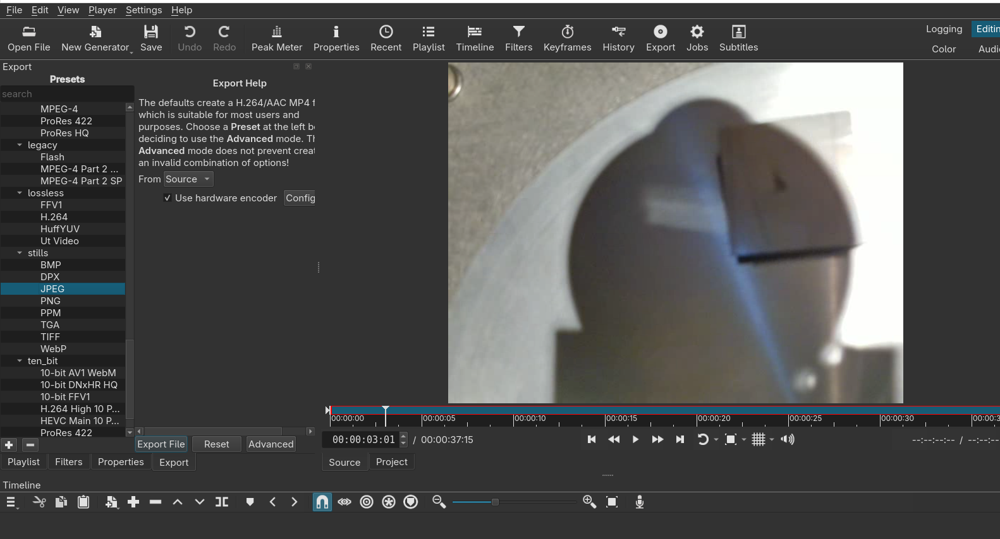
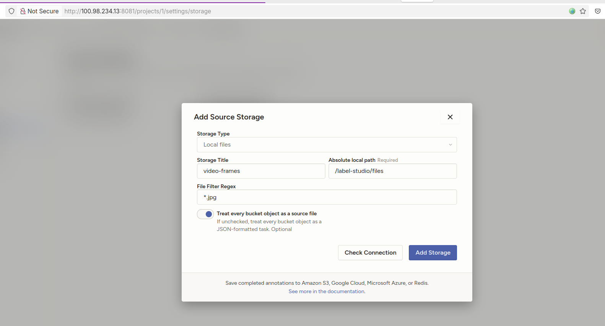
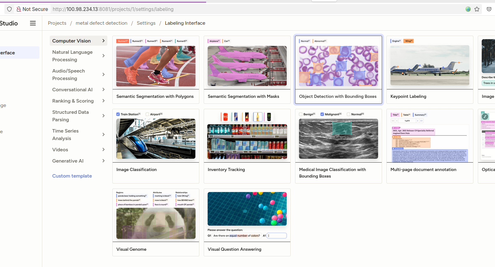
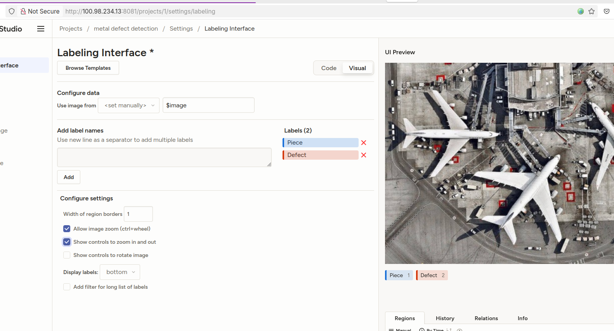
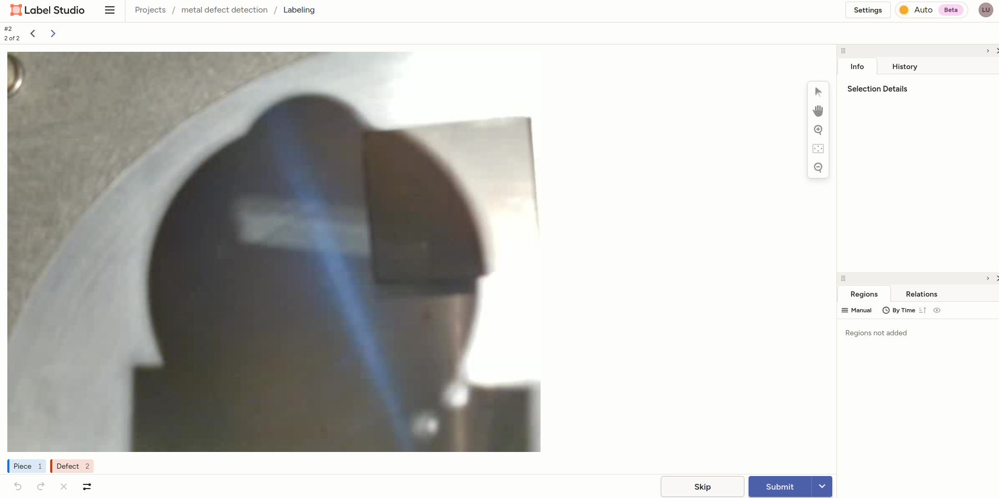
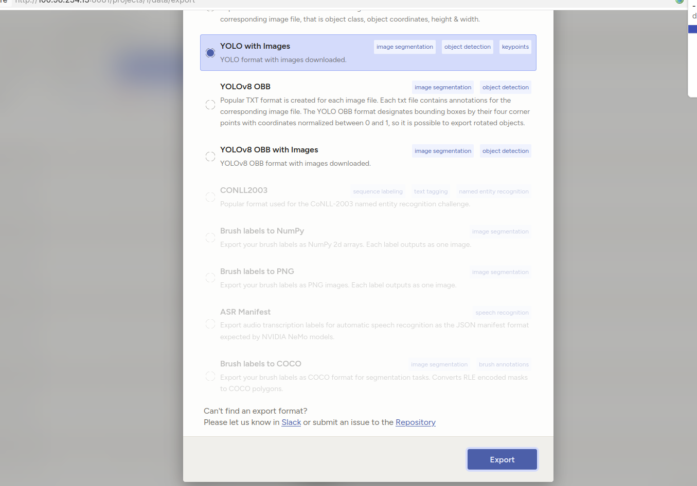
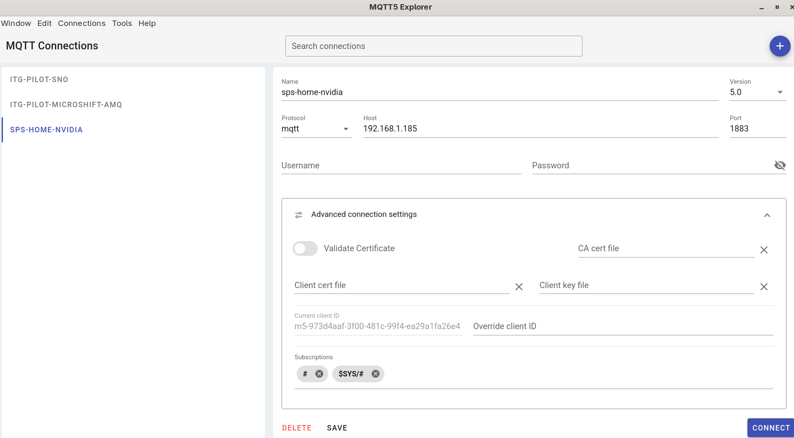
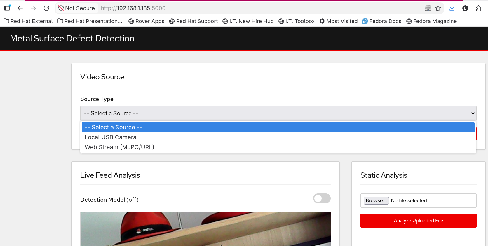
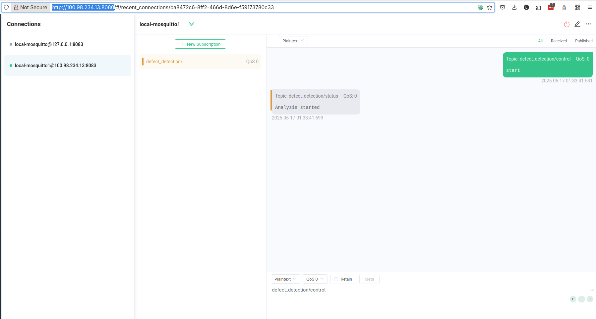

# Python defect detection application

## How to train the model
Use the recording functionality to get a video of the scenario you want to train your model on.

Using a tool like Shotcut, export the video into single frames.



You can now use a tool like [labelstudio](https://labelstud.io/) and start labelling the images according to the classification in classes you need.

To start Label Studio as a container:

```bash
podman run -d --replace --name label-studio -e LABEL_STUDIO_LOCAL_FILES_SERVING_ENABLED=true -e LABEL_STUDIO_LOCAL_FILES_DOCUMENT_ROOT=/label-studio/files -v /home/luca/apac-ai:/label-studio/files --privileged -p 8081:8080 -v /home/luca/label-studio:/label-studio/data heartexlabs/label-studio:latest
```

Setup local storage on Label Studio like shown (check instructions [here](https://labelstud.io/guide/storage#Local-storage))



We can also add a YOLO backend to help us annotate quicker [like shown](https://labelstud.io/tutorials/yolo) if needed.

Let's setup the Project as object classification.







After you complemented manual labelling you can export the labelled set into YOLO format

 

Now copy the images to the `images` folder and then separate them into train and validation (follow [this process](https://www.ejtech.io/learn/train-yolo-models))

You can run the training in a dedicated container starting first a dedicated ultralytics containaer like this:

```bash
sudo podman run -it --replace --name ultralytics --device nvidia.com/gpu=all --shm-size=4g --privileged -v /home/luca/dataset:/ultralytics/dataset ultralytics/ultralytics:latest-jetson-jetpack6 
```

*The shm-size parameter is to make sure the container is assigned enough shared memory to spin up enough torch workers*

... and then starting the training inside the container like this (this took me approx 30 minutes on the Jetson Orin):

```bash
yolo detect train data=config.yaml model=yolo11n.pt epochs=50 imgsz=640
```

Once you completed the training in the container you should see at the end of the executiong something like this:

```bash
50 epochs completed in 0.401 hours.
Optimizer stripped from /ultralytics/runs/detect/train/weights/last.pt, 5.5MB
Optimizer stripped from /ultralytics/runs/detect/train/weights/best.pt, 5.5MB

Validating /ultralytics/runs/detect/train/weights/best.pt...
Ultralytics 8.3.156 🚀 Python-3.10.12 torch-2.5.0a0+872d972e41.nv24.08 CUDA:0 (Orin, 7290MiB)
YOLO11n summary (fused): 100 layers, 2,582,542 parameters, 0 gradients, 6.3 GFLOPs
                 Class     Images  Instances      Box(P          R      mAP50  mAP50-95): 100%|██████████| 7/7 [00:04<00:00,  1.53it/s]
                   all        200        257      0.976      0.977      0.975      0.658
                Defect         30         30      0.959      0.967      0.955       0.53
                 Piece        200        227      0.993      0.987      0.995      0.786
Speed: 0.5ms preprocess, 11.2ms inference, 0.0ms loss, 3.2ms postprocess per image
Results saved to /ultralytics/runs/detect/train
💡 Learn more at https://docs.ultralytics.com/modes/train
```

You can now export the trained model from the container to use it in the Python defect detection app.

```bash
cp -r /ultralytics/runs/detect /ultralytics/dataset/
```

You can find the results of running the defect detection app with the trained `best.pt` model here

[](https://youtu.be/4DfhFfNF3l0)

## Setup and Installation

### Prerequisites

  - Nvidia Jetson Orin Nano Dev Kit with Jetpack 6.2+ (Jetson Linux 36.5+)
  - Python 3.8+
  - pip package manager
  - An MQTT broker (like Mosquitto) accessible on the network.
  - A YOLO model file (e.g., best.pt) trained for defect detection.

### Flashing your Nvidia device to latest Jetpack

1. Grab the latest Jetson Linux tar file (v36 can be found [here](https://developer.nvidia.com/embedded/jetson-linux-r365))
2. Set the Nvidia platform in Recovery Mode: connect female to female cable between pin 9 and 10 (FC REC - GND)
3. Install the following packages on the RHEL host that is connected via USB-C recovery cable to Nvidia device: `sudo dnf install minicom dtc binutils usbutils lz4`
4. Connect your RHEL host computer to the appropriate USB port on your Jetson developer kit (make sure of the side of the USB-C cable plugged into the Nvidia Device).
5. Open a terminal window on your host computer and enter command `lsusb`. The Jetson module is in Force Recovery Mode if you see the message:  
    `Bus <bbb> Device <ddd>: ID 0955: <nnnn> Nvidia Corp.`  
    Where:  
      - <bbb> is any three-digit number.  
      - <ddd> is any three-digit number.  
      - <nnnn> is a four-digit number that represents the type of your Jetson module:  
          . 7023 for Jetson AGX Orin (P3701-0000 with 32GB)  
          . 7023 for Jetson AGX Orin (P3701-0005 with 64GB)  
          . 7023 for Jetson AGX Orin Industrial (P3701-0008 with 64GB)  
          . 7223 for Jetson AGX Orin (P3701-0004 with 32GB)  
          . 7323 for Jetson Orin NX (P3767-0000 with 16GB)  
          . 7423 for Jetson Orin NX (P3767-0001 with 8GB)  
          . 7523 for Jetson Orin Nano (P3767-0003 and P3767-0005 with 8GB)  
          . 7623 for Jetson Orin Nano (P3767-0004 with 4GB)  
6. Proper power and USB [connection sequence](https://www.youtube.com/watch?v=q4fGac-nrTI&t=183s):
    - Remove the power cable from the Jetson device.
    - Connect the jumper between FC REC and GND pins.
    - Plug in the power cable to turn on the device.
    - Connect the USB Type-C cable between the Jetson and the host computer.
7. Create a directory to extract this file:
    `$ mkdir ${HOME}/nvidia-jetson`
   Extract both files to the same created directory in order to start flashing:  
    `$ tar xf Jetson_Linux_R36.5.0_aarch64.tbz2 -C ${HOME}/nvidia-jetson/`  
  Change the directory context to the directory where the flash.sh script is present:  
  `$ cd ${HOME}/nvidia-jetson/Linux_for_Tegra/`  
  Flash the QSPI firmware which holds NVIDIA Jetson bootloaders.  
  *For Jetson Jetson Orin Nano:*  
  `$ sudo ./flash.sh p3768-0000-p3767-0000-a0-qspi external`  
  When the QSPI firmware flashing completes, the device will reboot.
8. You should now see the minor version updated:  
   `$ cat /etc/nv_tegra_release`  
  `# R36 (release), REVISION: 5.0, GCID: 43688277, BOARD: generic, EABI: aarch64, DATE: Fri Jan 16 03:50:45 UTC 2026`

### Installing RHEL ImageMode 9.8 on Nvidia Jetson

Follow [these instructions](https://access.redhat.com/solutions/7140448) and build a dedicated boot ISO with [Containerfile.ImageMode](Containerfile.ImageMode).  
You will notice this includes both **Tailscale** client (mesh VPN) and **Flightctl** (to enroll the Device to **Red Hat Edge Manager**)

### Running the app natively

1.  Clone/Download the project files
2.  Install Python dependencies:
    ```bash
    pip install -r requirements.txt
    ```
3.  Place your model: Put your trained `.pt` model file inside the `models/` directory.

### Git LFS (model weights)

`*.pt` files (`models/best.pt`, `models/yolo11n.pt`) are tracked with [Git LFS](https://git-lfs.com/) instead of being committed directly, since they're large binaries. A plain `git clone`/`git pull` on a machine without Git LFS installed will leave you with tiny text pointer files instead of real weights — this is what can cause the YOLO model to silently fail to load (`YOLO(MODEL_PATH)`) even though the file exists and has the right name/path.

**Install Git LFS (one-time, per machine):**

```bash
sudo dnf install git-lfs   # RHEL/Fedora
# or: sudo apt install git-lfs   # Debian/Ubuntu
git lfs install
```

**Pull the actual model weights** (after cloning, or if you suspect you only have pointer files):

```bash
git lfs pull
```

To check whether a file is a real binary or still just an LFS pointer, look at its size or the first line:

```bash
head -c 200 models/best.pt
# A pointer file looks like:
#   version https://git-lfs.github.com/spec/v1
#   oid sha256:...
#   size 5457939
# A real weights file will show binary/garbage output instead.
```

**Pushing a new/updated model:**

```bash
git add models/best.pt        # staged as an LFS object because of .gitattributes
git commit -m "Update trained model weights"
git push
```

Since `podman build`/`podman run` on the Jetson just read whatever is on disk in `models/`, always run `git lfs pull` after pulling code changes on that machine before rebuilding the container or restarting it.

### How to start everything automatically at system boot

See the created files in the folder [autostart](https://github.com/lucamaf/edge-defect-detector/tree/main/autostart).
You will find 2 systemd user services created based on the running **mosquitto** and **mqttx** containers and another service dedicated to launching the python application.

The priority is already set in the systemd definition so that:

1. mosquitto
2. mqttx
3. python-defect-app

Making sure the dependecies are correct between the 3 applications.

### Configuration

The application is configured using environment variables. This is especially important when running with Podman.

| Environment Variable  | Default Value                  | Description                                                                                             |
| --------------------- | ------------------------------ | ------------------------------------------------------------------------------------------------------- |
| `MQTT_BROKER`         | `localhost`                    | The IP address or hostname of your MQTT broker.                                                         |
| `MQTT_PORT`           | `1883`                         | The port for your MQTT broker.                                                                          |
| `MQTT_TOPIC_CONTROL`  | `defect_detection/control`     | The MQTT topic to send commands to the application.                                                     |
| `MQTT_TOPIC_STATUS`   | `defect_detection/status`      | The MQTT topic where the application publishes its status.                                              |
| `MODEL_PATH`          | `models/best.pt`               | The path inside the container to the YOLO model file.                                                 |
| `FLASK_WEB_PORT`      | `5000`                         | The port on which the Flask web server will listen inside the container.                                  |
| `RECORDING_PATH`      | `recordings`                   | The directory inside the container where recorded videos will be saved.                                 |
| `VIDEO_FORMAT`        | `XVID`                         | The FourCC code for the video codec. `XVID` for `.avi` or `mp4v` for `.mp4`.                              |

### How to Run the Application natively

*Make sure you have started the MQTT broker first*

1.  Set the environment variables in your terminal (optional, defaults will be used), for example:
    ```bash
    export MQTT_BROKER="192.168.1.100"
    ```
2.  Run the application:
    ```bash
    python app.py
    ```
3.  Access the UI by navigating to [localhost:5000](http://localhost:5000).

### How to Build and Run the Container

- Step 1: Place Your Model
  Make sure your trained model file (e.g., best.pt) is inside the models directory.

- Step 2: Build the Container Image
  Open a terminal in the project root directory (/defect-detector-app/) and run (to build the **CPU** version of the app):

```bash
podman build -t localhost/defect-detector -f Containerfile .
```

To build instead the version that is based on libraries already compiled for **Jetson GPU** and that can leverage natively Nvidia device on the Jetson (we are using `sudo` since we will be running the container as such):

```bash
sudo podman build -t localhost/defect-detector-jetson -f Containerfile.jetson .
```

- Step 3: Run the Container  
  Now, run the container. The commands below shows how to override the environment variables and map necessary resources.

    `--device /dev/video1:/dev/video1`: This maps your host's webcam into the container so OpenCV can access it.  
    `-v "$(pwd)/models":/app/models`: This mounts your local models directory into the container. This is the best practice for handling large model files, as it keeps them out of the image itself.  
    `-p 8080:5000`: This maps port 8080 on your host machine to port 5000 inside the container. You will access the UI at http://localhost:8080.

Make sure to start first the MQTT broker (either natively or containerized like shown below).

```bash
podman run -d  --replace --privileged --name mosquitto -p 1883:1883 -v "$PWD/mosquitto/config:/mosquitto/config" -v "$PWD/mosquitto/data:/mosquitto/data" -v "$PWD/mosquitto/log:/mosquitto/log" docker.io/library/eclipse-mosquitto
```

Should you want to check that the mqtt broker is running fine, connect remotely or locally using MQTT Explorer and subscribe to system topic tree: `$SYS\#`  
Now you can run the python app containerized (the following is the command that leverages **Nvidia GPU** and the `defect-detector-jetson` built image). 
> **_NOTE:_** The model is injected at runtime and not build time, so that you can switch the model quickly, without rebuilding.  

```bash
sudo podman run -d --replace --privileged \
    --security-opt label=disable \
    --name my-detector \
    --device nvidia.com/gpu=all \
    --shm-size=1g \
    -p 5000:5000 \
    --device /dev/video1:/dev/video1 \
    -v "$(pwd)/models":/app/models \
    -e MQTT_BROKER="192.168.100.245" \
    -e MQTT_PORT="1883" \
    -e FLASK_WEB_PORT="5000" \
    -e MODEL_PATH="/app/models/best.pt" \
    localhost/defect-detector-jetson
```

(Replace 192.168.100.245 with your actual MQTT broker's IP address)

- Step 4: Access Your Application  
  You can now open your web browser and navigate to http://<NVIDIA-DEVICE-IP-ADDRESS>:5000 to see your application running. Make sure to open port 5000 on the Nvidia jetson firewall.  

### Web Interface

* **Video Source:** Select either "Local USB Camera" or "Web Stream". If you select Web Stream, an input field will appear for you to enter the stream URL. Click "Update Video Source" to activate it. The live feed will appear under "Live Feed Analysis". If you select "Local USB Camera" it will pickup the device you passthrough with the podman command, you might need to refresh the page to visualize the stream.  
* **Static Analysis:** Use the "Analyze Uploaded File" form to upload an image or a video.
    * **Images:** The result appears almost instantly.
    * **Videos:** A progress bar will appear. The application is processing the video in the background. Once complete, the annotated video will be displayed.

### Remote access to MQTT broker  
You can use any MQTT client for such purpose, in my case I'm using MQTT Explorer.  
You can find the example connnection parameters in the picture 
In my case port 1883 is open and reachable from the MQTT Explorer app.  
You can use the container MQTT Explorer application to send MQTT messages to the containerized mosquitto we started earlier.  

### Controlling the app with the GUI
Once the USB camera is selected and streaming you can enable the real-time model with the switch you see at the top of the screen .  
This works likes an ON/OFF button and behind that MQTT messages are being sent to enable and disable the detection.  


### Controlling the app with MQTT

You can control the real-time defect detection on the live video stream by publishing messages to the `defect_detection/control` MQTT topic.


TOPIC **defect_detection/control**  
- To start the analysis, publish the message: **start**
- To stop the analysis, publish the message: **stop**

You can use any MQTT client (e.g., MQTTX, mosquitto_pub) to send these commands. 
Once started the application will also publish its status (*Detector online*, *Analysis started*, *Analysis stopped*) to the `defect_detection/status` topic.

TOPIC **defect_detection/status**
- view status of analysis  

You can now also record video from the camera using specific messages to the `defect_detection/control` MQTT topic

TOPIC **defect_detection/control**  
- To start recording, publish: **start_recording**
- To stop recording, publish: **stop_recording**

## Troubleshooting the app

### View live logs

To view logs or stop the container:

```bash
podman logs -f my-detector
```

### Stop and remove the container

```bash
podman stop my-detector
podman rm my-detector
```